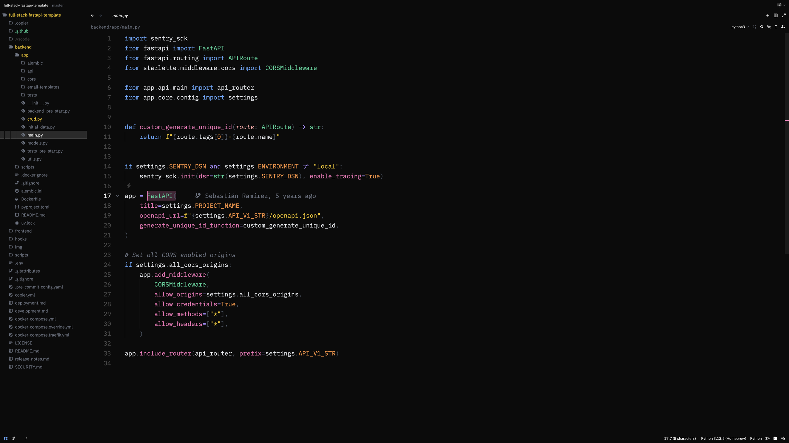
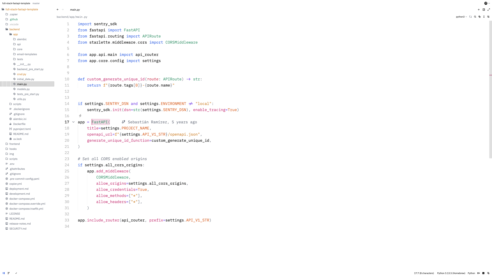

# Dogi Theme for [Zed](https://zed.dev/)

A minimalist flat theme for Zed with pure black and white backgrounds, vibrant syntax colors, and consistent font weights.

## 🎨 Features

- **Flat backgrounds** - Pure black (#000000) for dark mode, pure white (#FFFFFF) for light mode
- **Vibrant syntax highlighting** - Carefully selected colors for excellent code readability
- **Consistent font weights** - Medium weight (500) throughout for a uniform appearance
- **Two variants** - Both dark and light themes included

## 📸 Screenshots

### Dark Theme

### Light Theme

## 🚀 Installation

1. Open Zed
2. Press `Cmd+Shift+P` (macOS) or `Ctrl+Shift+P` (Linux) to open the command palette
3. Type `zed: extensions` and select it
4. Search for "Dogi"
5. Click Install
6. Select the theme via `theme selector: toggle` in the command palette

## 🎯 Design Philosophy

Dogi focuses on minimalism and clarity. By using pure black and white backgrounds with vibrant accent colors, it reduces visual noise while maintaining excellent readability for long coding sessions.

## 📝 License

[Apache License 2.0](LICENSE)

## 👤 Author

**Doğukan Ürker**

- GitHub: [@dogukanurker](https://github.com/dogukanurker)
- Email: dogukanurker@icloud.com
